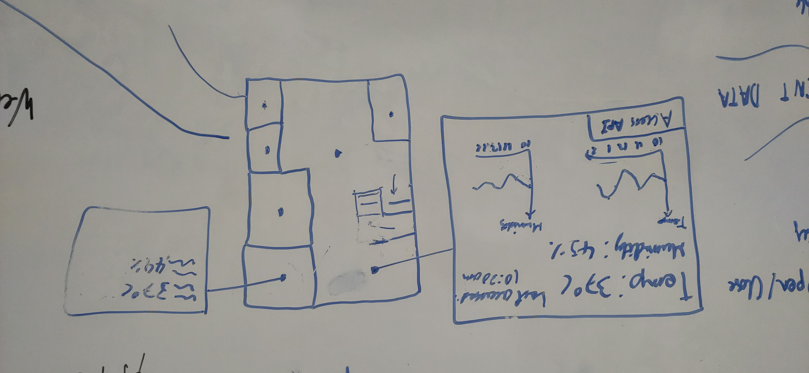

# The pitch

## Data visualisation

---

---

---

# The plan

## Backend

## Analysis

## Frontend

# Reality

# Backend

## Linode

---

## nix

The dream: `deploy .`
- sets up nixos on droplet
- pulls latest git repo
- builds and runs as systemd service

## nix - reality

`Error running /nix/store/sdaflpcozivpiouqwqp89057980249hojbx-flask-app/bootstrap.sh: Permission denied.`

## `deploy-rs`

`hello@droplet: Permission denied (publickey).`

## ubuntu

## systemd

## root

## bootstrap.sh

## build.sh

## serve

## ssh'd script as root

## tutorial

# Networking

## Domain name

## Banned?

# Analysis

## Ingestion

## Cleaning (throwing most of it away)

## API

## matplotlib

## tensorflow?!?

## scikitlearn?

